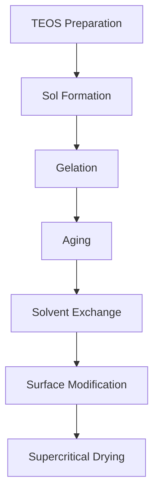
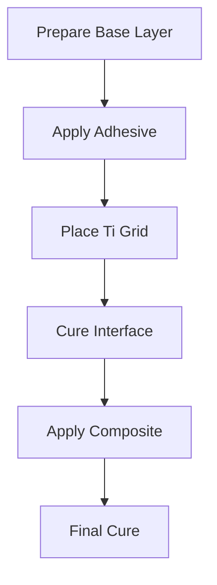
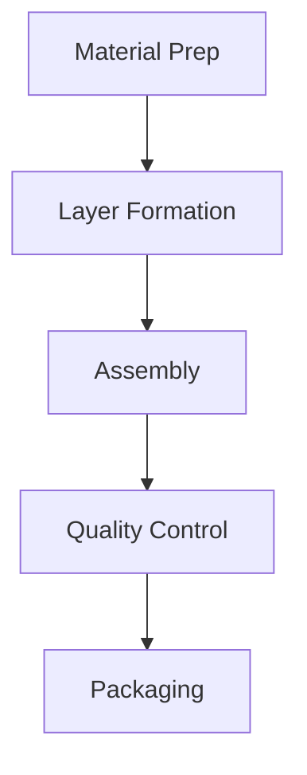

# Manufacturing Process Documentation

## 1. Facility Requirements

### Clean Room Specifications
- Class: ISO 7 (Class 10,000)
- Temperature: 20°C ± 2°C
- Humidity: 45% ± 5% RH
- Air changes: 60 per hour
- HEPA filtration: 99.97% at 0.3μm

### Equipment List
1. Primary Processing
   - Sol-gel reactor (5L capacity)
   - Supercritical CO2 dryer
   - Polyimide impregnation chamber
   - Titanium etching station
   - Thermal treatment oven

2. Quality Control
   - Thermal conductivity analyzer
   - Mechanical testing frame
   - Optical microscope
   - Surface profilometer
   - Environmental chamber

## 2. Material Preparation

### Aerogel Synthesis


#### Process Parameters
1. Sol Preparation
   - TEOS concentration: 1.5M
   - Ethanol ratio: 8:1
   - Catalyst: NH4OH (pH 8.5)
   - Temperature: 23°C

2. Gelation
   - Time: 24 hours
   - Temperature: 25°C
   - Humidity: 50%

3. Aging
   - Duration: 48 hours
   - Medium: Ethanol
   - Temperature: 50°C

4. Supercritical Drying
   - Pressure: 7.5 MPa
   - Temperature: 45°C
   - Flow rate: 2 mL/min
   - Duration: 4 hours

### Polyimide Processing

1. Monomer Preparation
   ```
   Temperature: 25°C
   Concentration: 15 wt%
   Solvent: NMP
   ```

2. Polymerization
   ```
   Duration: 6 hours
   Temperature: 80°C
   Atmosphere: N2
   ```

3. Imidization
   ```
   Stage 1: 100°C, 1 hour
   Stage 2: 200°C, 1 hour
   Stage 3: 300°C, 1 hour
   ```

## 3. Layer Assembly Process

### Titanium Grid Preparation
1. Material: Grade 5 Ti-6Al-4V
2. Thickness: 0.3mm
3. Hexagon dimensions:
   - Width: 5mm
   - Spacing: 0.5mm
4. Surface treatment:
   - Plasma cleaning
   - Silane coupling agent

### Layer Integration



#### Assembly Parameters
1. Base Layer
   - Temperature: 23°C
   - Humidity: 40%
   - Clean room: Class 10,000

2. Adhesive Application
   - Type: Modified epoxy
   - Thickness: 50μm
   - Coverage: 100%

3. Curing Cycle
   ```
   Stage 1: 80°C, 2 hours
   Stage 2: 120°C, 1 hour
   Stage 3: 150°C, 1 hour
   ```

## 4. Quality Control

### In-Process Testing
1. Layer thickness
2. Adhesion strength
3. Flexibility
4. Visual inspection

### Final Testing
1. Thermal performance
   - Conductivity
   - Maximum temperature
   - Thermal cycling

2. Mechanical properties
   - Tensile strength
   - Flex resistance
   - Impact resistance

3. Environmental testing
   - Temperature cycling
   - Humidity resistance
   - UV exposure

## 5. Production Flow



### Production Metrics
- Batch size: 5m²
- Cycle time: 24 hours
- Yield target: 95%
- Quality target: 99%

## 6. Safety Protocols

### Chemical Handling
1. PPE Requirements
   - Chemical resistant gloves
   - Face shield
   - Lab coat
   - Respirator

2. Waste Management
   - Solvent collection
   - Solid waste segregation
   - Chemical neutralization

### Emergency Procedures
1. Chemical spill response
2. Fire safety
3. First aid
4. Evacuation plan

## 7. Documentation

### Required Records
1. Batch records
2. Test results
3. Equipment logs
4. Maintenance records
5. Training records

### Data Collection
```python
def record_batch_data(batch_id, parameters):
    """
    Record batch manufacturing data
    """
    return {
        "batch_id": batch_id,
        "timestamp": datetime.now(),
        "parameters": parameters,
        "operator": operator_id,
        "equipment_status": equipment_status
    }
```

## 8. Troubleshooting Guide

### Common Issues
1. Thickness variation
2. Adhesion failure
3. Thermal performance
4. Flexibility issues

### Resolution Procedures
[Decision tree for common issues]

