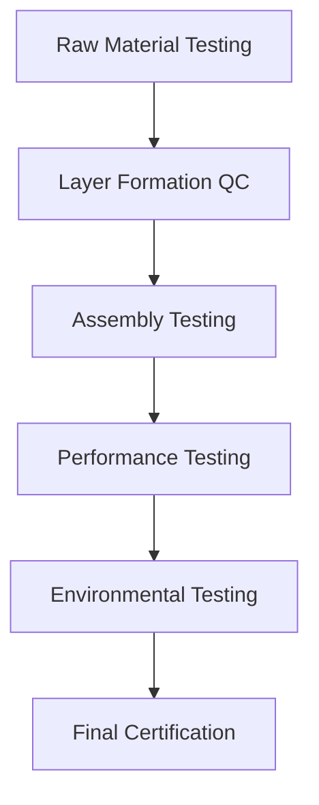
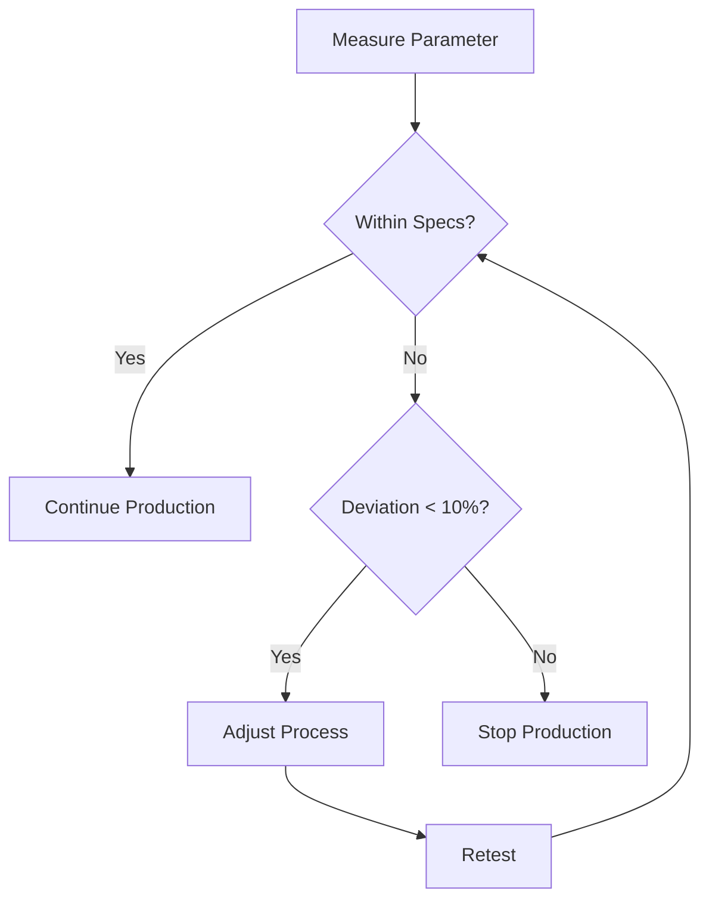
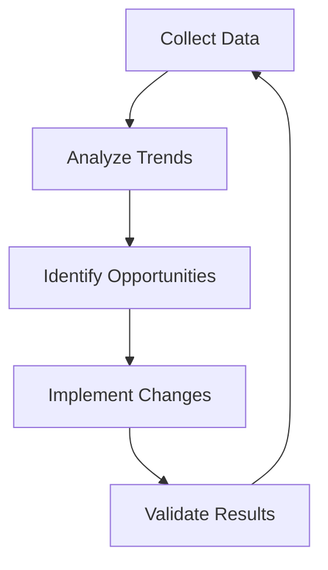

# Hexaphexah Testing and Quality Control Protocols
Version: 1.0.0
Last Updated: 2024-12-28

## 1. Testing Categories

### 1.1 Material Testing

#### Aerogel Component
```yaml
Tests:
  - Density:
      method: "ASTM D1622"
      acceptable_range: "0.1-0.15 g/cm³"
      frequency: "Each batch"
      equipment: "Density analyzer"
      
  - Porosity:
      method: "Mercury porosimetry"
      acceptable_range: "90-95%"
      frequency: "Sample basis"
      equipment: "Porosimeter"
      
  - Surface Area:
      method: "BET analysis"
      acceptable_range: ">500 m²/g"
      frequency: "Batch certification"
```

#### Polyimide Matrix
```yaml
Tests:
  - Glass Transition:
      method: "DSC analysis"
      acceptable_range: "350-400°C"
      frequency: "Each batch"
      
  - Tensile Strength:
      method: "ASTM D638"
      acceptable_range: ">120 MPa"
      frequency: "Each batch"
      
  - Chemical Resistance:
      method: "ASTM D543"
      exposure_time: "168 hours"
      chemicals: ["Acids", "Bases", "Organic solvents"]
```

### 1.2 Composite Testing

#### Thermal Performance
```python
def thermal_test_protocol():
    test_conditions = {
        'temperature_range': (-150, 400),  # °C
        'cycle_count': 100,
        'dwell_time': 30,  # minutes
        'ramp_rate': 10    # °C/min
    }
    
    measurement_points = [
        'surface_temperature',
        'internal_temperature',
        'thermal_conductivity'
    ]
    
    return test_conditions, measurement_points
```

#### Mechanical Testing
```yaml
Tests:
  - Flex Testing:
      method: "ASTM D790"
      cycles: 1000
      bend_radius: "45 degrees"
      frequency: "Each production batch"
      
  - Impact Resistance:
      method: "ASTM D3763"
      energy_levels: [10J, 20J, 30J]
      temperature_conditions: [-50°C, 25°C, 150°C]
      
  - Delamination Resistance:
      method: "ASTM D3167"
      minimum_force: "50 N/cm"
      test_speed: "25 mm/min"
```

### 1.3 Production QC

#### In-Process Testing
```sql
CREATE TABLE production_qc_points (
    id SERIAL PRIMARY KEY,
    stage VARCHAR(50),
    parameter VARCHAR(50),
    lower_limit DECIMAL,
    upper_limit DECIMAL,
    measurement_frequency INTERVAL,
    action_required BOOLEAN
);
```

#### Layer Thickness Monitoring
```python
class ThicknessMonitoring:
    def __init__(self):
        self.tolerances = {
            'protective_layer': (0.19, 0.21),  # mm
            'aerogel_layer': (0.95, 1.05),     # mm
            'titanium_grid': (0.29, 0.31),     # mm
            'composite_layer': (0.95, 1.05),    # mm
            'd3o_layer': (0.48, 0.52)          # mm
        }
    
    def check_thickness(self, layer, measurement):
        min_val, max_val = self.tolerances[layer]
        return min_val <= measurement <= max_val
```

## 2. Testing Equipment

### 2.1 Required Equipment List
```yaml
Thermal Testing:
  - Thermal Conductivity Analyzer:
      model: "NETZSCH HFM 446"
      calibration_frequency: "6 months"
      
  - Environmental Chamber:
      model: "Thermotron SE-600"
      temperature_range: "-150°C to 500°C"
      size: "1m³"
      
Mechanical Testing:
  - Universal Testing Machine:
      model: "Instron 5985"
      load_cell: "100 kN"
      
  - Impact Tester:
      model: "Instron CEAST 9350"
      energy_range: "0.59-757 J"

Optical Testing:
  - Digital Microscope:
      model: "Keyence VHX-7000"
      magnification: "20x-2000x"
      
  - 3D Surface Profilometer:
      model: "Bruker Contour GT-K"
      resolution: "0.1 nm vertical"
```

### 2.2 Calibration Requirements
```yaml
Daily Calibration:
  - Temperature sensors
  - Thickness gauges
  - Pressure sensors

Weekly Calibration:
  - Load cells
  - Impact testers
  - Thermal conductivity analyzers

Monthly Calibration:
  - Environmental chambers
  - Optical systems
  - Material testing machines
```

## 3. Testing Procedures

### 3.1 Sample Preparation
```python
def prepare_test_sample(dimensions, conditioning):
    """
    Prepare test samples according to specifications
    """
    specifications = {
        'standard_sample': {
            'length': 100,  # mm
            'width': 100,   # mm
            'layers': 5
        },
        'conditioning': {
            'temperature': 23,  # °C
            'humidity': 50,     # %RH
            'duration': 24      # hours
        }
    }
    
    return specifications
```

### 3.2 Testing Sequence


## 4. Data Collection and Analysis

### 4.1 Data Collection System
```typescript
interface TestData {
    batchId: string;
    testType: TestType;
    timestamp: Date;
    measurements: {
        parameter: string;
        value: number;
        unit: string;
        uncertainty: number;
    }[];
    equipment: {
        id: string;
        calibrationDate: Date;
    };
    operator: string;
    environmentalConditions: {
        temperature: number;
        humidity: number;
        pressure: number;
    };
}
```

### 4.2 Statistical Analysis
```python
def analyze_test_results(data_series):
    """
    Perform statistical analysis on test results
    """
    analysis = {
        'mean': np.mean(data_series),
        'std_dev': np.std(data_series),
        'cp': calculate_process_capability(data_series),
        'cpk': calculate_process_capability_index(data_series)
    }
    
    return analysis
```

## 5. Quality Control Decision Trees

### 5.1 Production QC


### 5.2 Failure Analysis Protocol
```yaml
Analysis Steps:
  1. Document Failure:
     - Location
     - Type
     - Conditions
     
  2. Material Analysis:
     - Microscopy
     - Chemical analysis
     - Physical testing
     
  3. Root Cause Analysis:
     - Process review
     - Material tracking
     - Environmental factors
     
  4. Corrective Actions:
     - Process adjustment
     - Material modification
     - Quality control enhancement
```

## 6. Reporting and Documentation

### 6.1 Test Report Template
```markdown
# Test Report
## Basic Information
- Test ID: [ID]
- Date: [Date]
- Operator: [Name]
- Batch: [Batch Number]

## Test Parameters
- Type: [Test Type]
- Method: [Method Reference]
- Equipment: [Equipment ID]

## Results
- Measurements: [Data]
- Analysis: [Statistical Analysis]
- Pass/Fail: [Status]

## Attachments
- Raw Data
- Images
- Calibration Certificates
```

### 6.2 Quality Documentation System
```typescript
interface QualityDocument {
    id: string;
    type: DocumentType;
    version: string;
    effectiveDate: Date;
    expiryDate: Date;
    content: string;
    approvals: Approval[];
    relatedProcedures: string[];
    changeHistory: ChangeLog[];
}
```

## 7. Continuous Improvement

### 7.1 Performance Metrics
```yaml
Key Metrics:
  - First Pass Yield
  - Defect Rate
  - Process Capability
  - Testing Cycle Time
  - Material Waste
  - Energy Efficiency
```

### 7.2 Improvement Process

